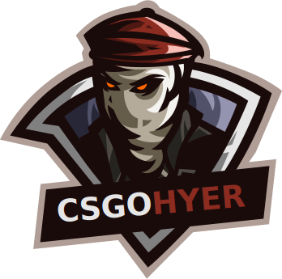

  

<h3
  align="center"
  style="margin-bottom: 30px; font-weight: bold"
>Crie sua .cfg agora e facilite sua vida no jogo, com as binds de compra você terá o que precisa em segundos.</h3>

## Planejamento

- [Veja a documentação completa no Whimsical](https://whimsical.com/XhtKL6PnR4p4BAFLP47Jz)

<iframe style="border:none" width="800" height="450" src="https://whimsical.com/embed/XhtKL6PnR4p4BAFLP47Jz"></iframe>

## :office: Links úteis

- [UI do projeto em .XD](#)
- [Lista de objetivos do projeto](#)

## :rocket: Tecnologias

Esse projeto foi desenvolvido com as seguintes tecnologias:

- [react-js](https://reactjs.org/) como framework
- [react-simple-keyboard](https://franciscohodge.com/projects/simple-keyboard/demo-showcase/) para criar o teclado virtual
- [react-icons](https://react-icons.netlify.com/) ícones no projeto
- [styled-components](https://www.styled-components.com/) autoexplicativo
- [VS Code](https://code.visualstudio.com/) como editor de código
- [Adobe XD](https://xd.adobe.com/) para criar o protótipo das telas
- [whimsical](https://whimsical.com/) para planejamento e documentação

## :memo: Licença

Este projeto está sob a licença MIT.

---

Made with ♥ by the Hyerdev team - [Get in touch!](http://hyerdev.com/)
